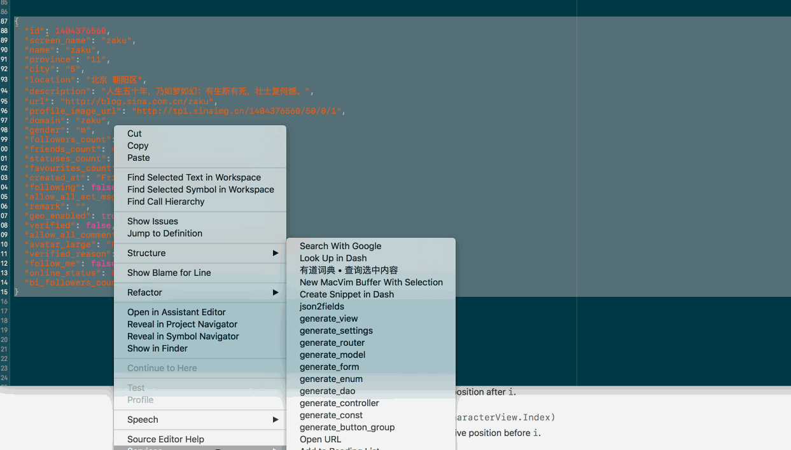

# iOS Code Generator
Let Code generate Code


## 一: 从 API 到 Model
这里的目的是自动将 API 的返回转成 Model.
我以 微博 API 为例进行说明:
比如 微博中的用户对象. 其 API 返回 示例如下:

```json
{
                "id": 1404376560,
                "screen_name": "zaku",
                "name": "zaku",
                "province": "11",
                "city": "5",
                "location": "北京 朝阳区",
                "description": "人生五十年，乃如梦如幻；有生斯有死，壮士复何憾。",
                "url": "http://blog.sina.com.cn/zaku",
                "profile_image_url": "http://tp1.sinaimg.cn/1404376560/50/0/1",
                "domain": "zaku",
                "gender": "m",
                "followers_count": 1204,
                "friends_count": 447,
                "statuses_count": 2908,
                "favourites_count": 0,
                "created_at": "Fri Aug 28 00:00:00 +0800 2009",
                "following": false,
                "allow_all_act_msg": false,
                "remark": "",
                "geo_enabled": true,
                "verified": false,
                "allow_all_comment": true,
                "avatar_large": "http://tp1.sinaimg.cn/1404376560/180/0/1",
                "verified_reason": "",
                "follow_me": false,
                "online_status": 0,
                "bi_followers_count": 215
            }
```

先来看一发动图, 感受下 从 API 到 Model 是多么的方便.
[

**使用的是通过 Automator 创建系统服务的方式来调用脚本**

首先执行 将  json 转成 fields ,通过 json_to_fields() 函数 .得到结果如下:

```
/// {
/// "id": 1404376560,
/// "screen_name": "zaku",
/// "name": "zaku",
/// "province": "11",
/// "city": "5",
/// "location": "北京 朝阳区",
/// "description": "人生五十年，乃如梦如幻；有生斯有死，壮士复何憾。",
/// "url": "http://blog.sina.com.cn/zaku",
/// "profile_image_url": "http://tp1.sinaimg.cn/1404376560/50/0/1",
/// "domain": "zaku",
/// "gender": "m",
/// "followers_count": 1204,
/// "friends_count": 447,
/// "statuses_count": 2908,
/// "favourites_count": 0,
/// "created_at": "Fri Aug 28 00:00:00 +0800 2009",
/// "following": false,
/// "allow_all_act_msg": false,
/// "remark": "",
/// "geo_enabled": true,
/// "verified": false,
/// "allow_all_comment": true,
/// "avatar_large": "http://tp1.sinaimg.cn/1404376560/180/0/1",
/// "verified_reason": "",
/// "follow_me": false,
/// "online_status": 0,
/// "bi_followers_count": 215
/// }
id:d;screen_name;name;province;city;location;description;url:u;profile_image_url:u;domain;gender;followers_count:i;friends_count:i;statuses_count:i;favourites_count:i;created_at;following:i;allow_all_act_msg:i;remark;geo_enabled:i;verified:i;allow_all_comment:i;avatar_large:u;verified_reason;follow_me:i;online_status:i;bi_followers_count:i
```

然后通过 ,字段名称及类型简写列表生成  Model.
这里假定 JSON 序列化库为 SwiftyJSON
为上模型名称及相应的配置 `User(eq,hash)`, 配置的意思看生成结果应该一目了然.

```
User(eq,hash)
id:d;screen_name;name;province;city;location;description;url:u;profile_image_url:u;domain;gender;followers_count:i;friends_count:i;statuses_count:i;favourites_count:i;created_at;following:i;allow_all_act_msg:i;remark;geo_enabled:i;verified:i;allow_all_comment:i;avatar_large:u;verified_reason;follow_me:i;online_status:i;bi_followers_count:i
```

生成出来的代码如下:

```swift
import SwiftyJSON
import BXModel
  struct User :BXModel{
    let id : Int
    let screenName : String
    let name : String
    let province : String
    let city : String
    let location : String
    let description : String
    let url : URL
    let profileImageUrl : URL
    let domain : String
    let gender : String
    let followersCount : Int
    let friendsCount : Int
    let statusesCount : Int
    let favouritesCount : Int
    let createdAt : String
    let following : Bool
    let allowAllActMsg : Bool
    let remark : String
    let geoEnabled : Bool
    let verified : Bool
    let allowAllComment : Bool
    let avatarLarge : URL
    let verifiedReason : String
    let followMe : Bool
    let onlineStatus : Int
    let biFollowersCount : Int

  init(json:JSON){
    self.id =  json["id"].intValue
    self.screenName =  json["screen_name"].stringValue
    self.name =  json["name"].stringValue
    self.province =  json["province"].stringValue
    self.city =  json["city"].stringValue
    self.location =  json["location"].stringValue
    self.description =  json["description"].stringValue
    self.url =  json["url"].stringValue.quietUrl
    self.profileImageUrl =  json["profile_image_url"].stringValue.quietUrl
    self.domain =  json["domain"].stringValue
    self.gender =  json["gender"].stringValue
    self.followersCount =  json["followers_count"].intValue
    self.friendsCount =  json["friends_count"].intValue
    self.statusesCount =  json["statuses_count"].intValue
    self.favouritesCount =  json["favourites_count"].intValue
    self.createdAt =  json["created_at"].stringValue
    self.following =  json["following"].boolValue
    self.allowAllActMsg =  json["allow_all_act_msg"].boolValue
    self.remark =  json["remark"].stringValue
    self.geoEnabled =  json["geo_enabled"].boolValue
    self.verified =  json["verified"].boolValue
    self.allowAllComment =  json["allow_all_comment"].boolValue
    self.avatarLarge =  json["avatar_large"].stringValue.quietUrl
    self.verifiedReason =  json["verified_reason"].stringValue
    self.followMe =  json["follow_me"].boolValue
    self.onlineStatus =  json["online_status"].intValue
    self.biFollowersCount =  json["bi_followers_count"].intValue
}

  func toDict() -> [String:Any]{
var dict : [String:Any] = [ : ]
    dict["id"] = self.id
    dict["screen_name"] = self.screenName
    dict["name"] = self.name
    dict["province"] = self.province
    dict["city"] = self.city
    dict["location"] = self.location
    dict["description"] = self.description
    dict["url"] = self.url.absoluteString
    dict["profile_image_url"] = self.profileImageUrl.absoluteString
    dict["domain"] = self.domain
    dict["gender"] = self.gender
    dict["followers_count"] = self.followersCount
    dict["friends_count"] = self.friendsCount
    dict["statuses_count"] = self.statusesCount
    dict["favourites_count"] = self.favouritesCount
    dict["created_at"] = self.createdAt
    dict["following"] = self.following
    dict["allow_all_act_msg"] = self.allowAllActMsg
    dict["remark"] = self.remark
    dict["geo_enabled"] = self.geoEnabled
    dict["verified"] = self.verified
    dict["allow_all_comment"] = self.allowAllComment
    dict["avatar_large"] = self.avatarLarge.absoluteString
    dict["verified_reason"] = self.verifiedReason
    dict["follow_me"] = self.followMe
    dict["online_status"] = self.onlineStatus
    dict["bi_followers_count"] = self.biFollowersCount
return dict
}
}

    extension User: Equatable{
         static func ==(lhs:User,rhs:User) -> Bool{
        return lhs.id == rhs.id
        }
    }


    extension  User : Hashable{
      var hashValue:Int{ return id.hashValue   }
    }

```


## 未完待续
项目其他生成脚本的使用说明,稍后更新.
